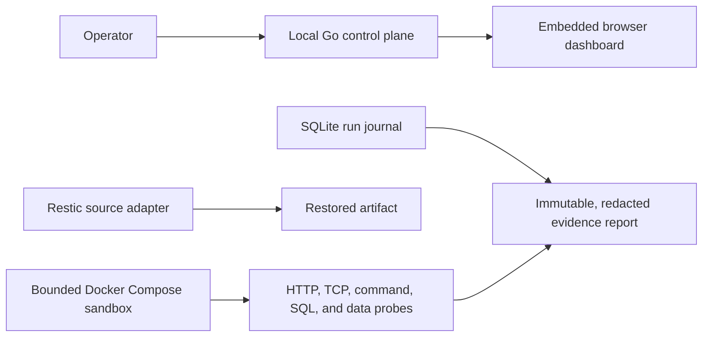
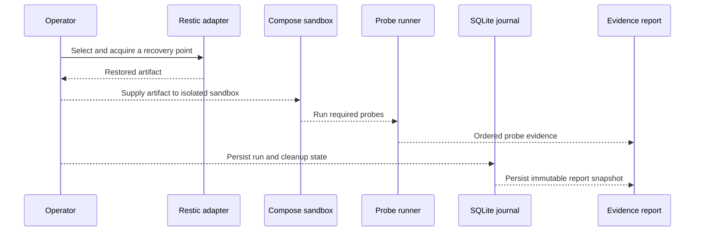

# Rehearse

**Prove a backup can become a working application before an incident does.**

Rehearse is a local recovery-rehearsal tool for Docker Compose applications. Its
current MVP slice provides the safety-critical building blocks for a recovery
drill: a localhost control plane, a durable SQLite run journal, a read-only
restic source adapter, a bounded Docker Compose sandbox, typed probes, and
redacted evidence reports. These components are covered by repository tests;
the command that composes them into one end-to-end application recovery drill is
the next integration step.

## What the current MVP demonstrates

The shipped runtime and libraries keep recovery work local and make its outcome
inspectable. Start the native binary to see the control plane and dashboard; run
the focused tests to exercise the recovery boundaries below.



The diagram is an architecture map of the components currently in the repository,
not a claim that the control plane wires every recovery component into one user
command yet.

| Capability | Current evidence | Status |
| --- | --- | --- |
| Local Go control plane and embedded dashboard | `make build`; browser smoke test in [`web/e2e/tracer-bullet.spec.ts`](web/e2e/tracer-bullet.spec.ts) | Available |
| Durable drill plans, ordered run states, restart reconciliation, and immutable SQLite history | [`internal/journal/store_test.go`](internal/journal/store_test.go) and [`internal/drill/run_test.go`](internal/drill/run_test.go) | Available as library/runtime boundary |
| Read-only restic recovery-point listing and acquisition | [`internal/source/restic/integration_test.go`](internal/source/restic/integration_test.go) via `make test-adapters` | Available as source-adapter boundary |
| Isolated Compose resources, cleanup, and crash reconciliation | [`internal/sandbox/docker_integration_test.go`](internal/sandbox/docker_integration_test.go) with `REHEARSE_DOCKER_INTEGRATION=1` | Available as sandbox boundary |
| Typed HTTP, TCP, command, SQL, and data probes | [`docs/probes-and-evidence.md`](docs/probes-and-evidence.md); [`internal/probe`](internal/probe) tests | Available as probe boundary |
| Canonical, redacted recovery evidence reports | [`internal/evidence/report_test.go`](internal/evidence/report_test.go) and [`internal/journal/report_store_test.go`](internal/journal/report_store_test.go) | Available as evidence boundary |
| One command that restores, boots, probes, reports, and cleans up an application | — | Planned integration |

## A short demo path

From a fresh checkout, install the web dependencies, build the native binary,
and open the local dashboard:

```bash
npm --prefix web ci
make build
./build/rehearse
```

Visit <http://127.0.0.1:8484>. The dashboard verifies its connection to the
versioned local API. In another terminal, confirm the control plane directly:

```bash
curl http://127.0.0.1:8484/api/v1/health
curl http://127.0.0.1:8484/api/v1/version
```

The following sequence describes the tested recovery path at the component
boundaries. The orchestration arrows are deliberately dashed: they are not yet
exposed as a complete user-facing drill command.



## Verify the shipped boundaries

Prerequisites: Go **1.26.8** (the version in [`go.mod`](go.mod)), Node.js 22 or
newer, and npm. Docker is required only for the integration commands below.

```bash
npm --prefix web ci
make test
make lint
make build
```

`make test` runs the Go and web unit suites. `make lint` runs `go vet` and the
web linter. `make build` rebuilds the embedded dashboard and the native binary.

For the optional real-boundary checks, install restic 0.18.0 or newer and ensure
a Docker-compatible runtime is running:

```bash
make test-adapters
make test-integration
docker pull alpine@sha256:28bd5fe8b56d1bd048e5babf5b10710ebe0bae67db86916198a6eec434943f8b
REHEARSE_DOCKER_INTEGRATION=1 go test -race ./internal/sandbox -count=1
```

`make test-adapters` uses real local and S3-compatible restic repositories.
`make test-integration` verifies the PostgreSQL probe boundary. The sandbox test
creates short-lived, Rehearse-labeled Docker resources and verifies cleanup.

## Why these boundaries exist

- **Local control plane:** Rehearse is a native Go binary that serves an embedded
  browser UI. Recovery data and credentials stay on the operator's machine.
- **SQLite journal:** plans, ordered run events, and cleanup truth are durable;
  cleanup is recorded separately from the execution outcome so a passing probe
  cannot disguise a failed cleanup.
- **Separate source and restore boundaries:** restic handles selecting and
  acquiring backup data without dictating how a target restores it.
- **Bounded Compose sandbox:** generated, labeled resources are isolated from
  unrelated Docker workloads and cleanup verifies ownership before deletion.
- **Evidence, not a success string:** reports preserve stage durations, selected
  recovery point, probe evidence, outcome, and cleanup state while redacting
  configured secret markers.

The design decisions and exact contracts are documented in
[`CONTEXT.md`](CONTEXT.md), [`docs/adr/`](docs/adr/), and
[`docs/probes-and-evidence.md`](docs/probes-and-evidence.md).

## Current limitations

- Rehearse does not yet ship a complete end-to-end recovery workflow that joins
  source acquisition, restore targeting, sandbox boot, probes, reporting, and
  cleanup behind one CLI or dashboard action.
- The current restic adapter and Compose sandbox are tested boundaries, not a
  promise of every backup source, restore target, or application topology.
- The dashboard currently proves the local control-plane connection; it is not a
  run-management interface.

## License

Apache License 2.0. See [LICENSE](LICENSE).
